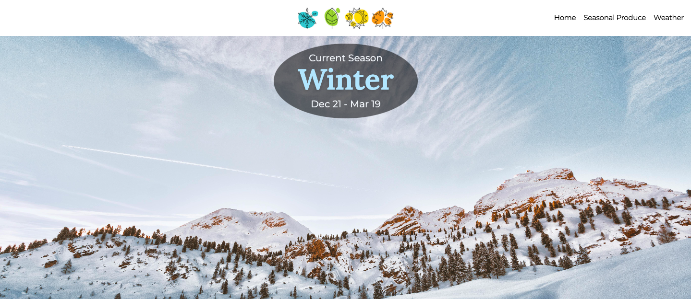
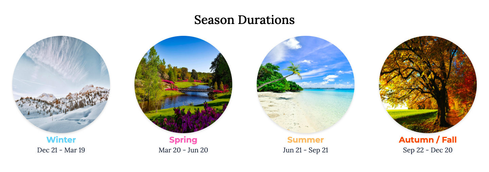
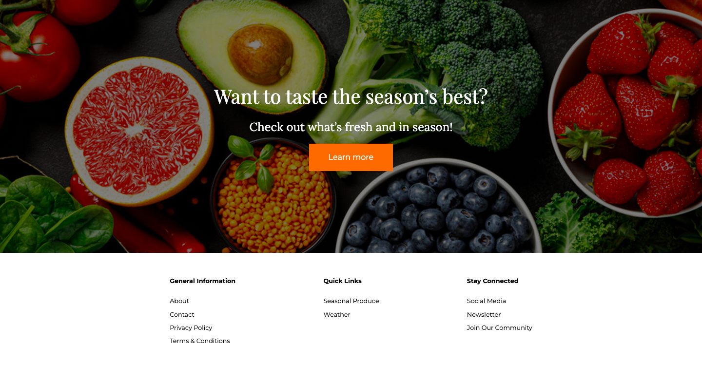
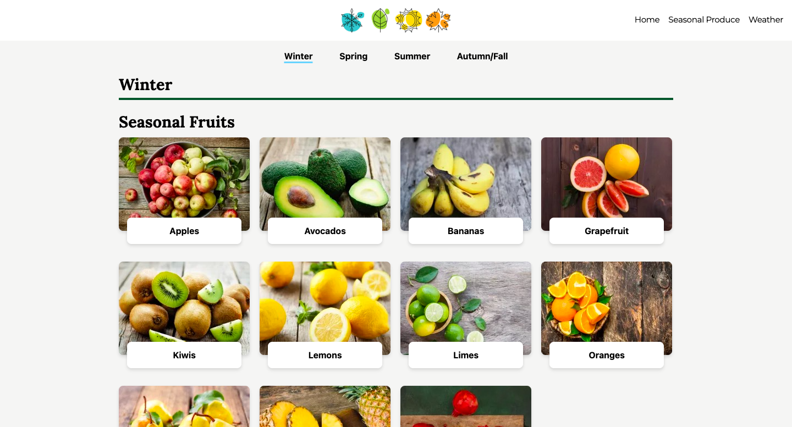
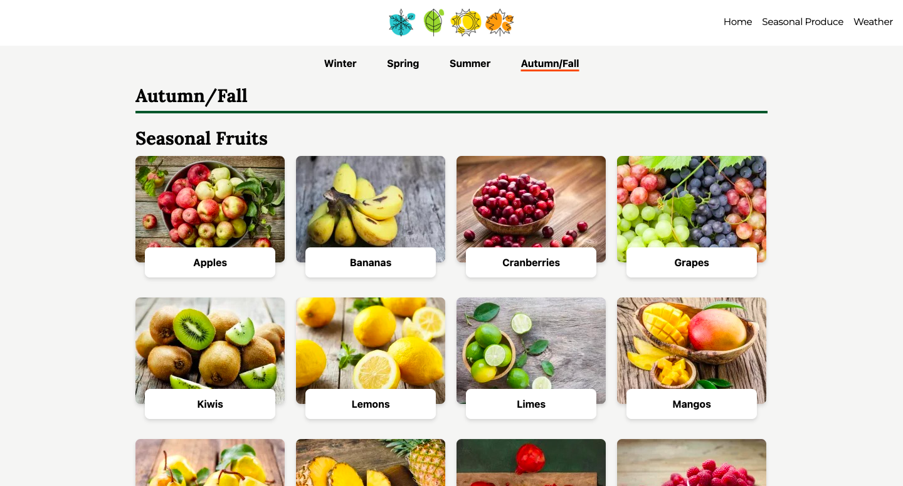
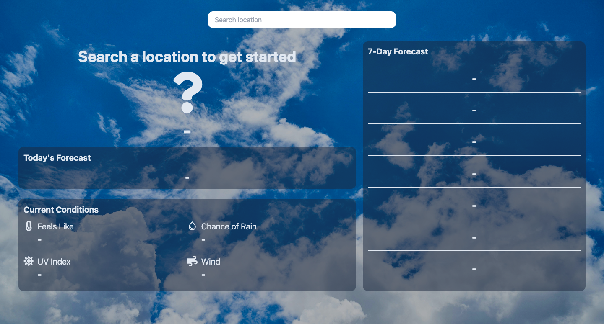
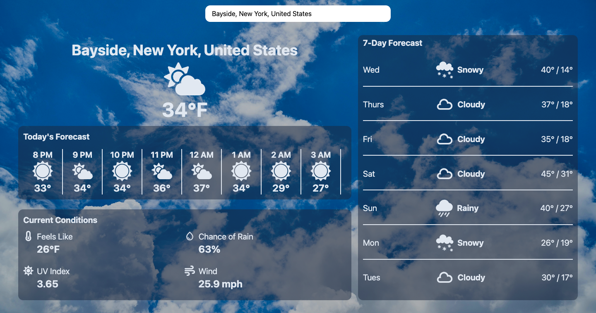

# Seasons and Weather Application
<a id="readme-top"></a>

<!-- TABLE OF CONTENTS -->
<details>
  <summary>Table of Contents</summary>
  <ol>
    <li>
      <a href="#about">About</a>
      <ul>
        <li><a href="#site-navigation">Site Navigation</a></li>
        <li><a href="#demo">Demo</a></li>
        <li><a href="#built-with">Built With</a></li>
      </ul>
    </li>
    <li>
      <a href="#installation---getting-started">Installation - Getting Started</a>
    </li>
    <li>
      <a href="#acknowledgments">Acknowledgments</a>
    </li>
  </ol>
</details>


## About
This Seasons and Weather Application combines real-time weather data with insights on the four seasons. It integrates with the external Open-Meteo RESTful API to retrieve location-based weather information and presents current conditions in real time.

The home page features a dynamic hero section that automatically updates based on the current season, determined by the current date. Users can explore details about each season like the date they begin and end, as well as browse a dedicated page featuring seasonal produce.

Inspired by my personal appreciation for nature and ongoing curiosity about what foods are in season throughout the year, this project blends practical functionality with a topic I genuinely enjoy. 

<p align="right">(<a href="#readme-top">back to top</a>)</p>


### Site Navigation

#### Home
Features a dynamic hero section that updates automatically based on the current season. Users can explore seasonal start and end dates and navigate to related content.

#### Seasonal Produce
Displays fruits and vegetables that are in season, helping users understand what produce aligns with each time of year.

#### Weather
Allows users to search for a location and view real-time weather data using the Open-Meteo API.

<p align="right">(<a href="#readme-top">back to top</a>)</p>

### Demo
- **Live Demo:** [View app](https://seasons-and-weather.onrender.com/)  
   - **NOTE: Hosting uses free tier, so may take a few seconds to 1 minute for the initial load**. If waiting for the live demo might be inconvenient, feel free to view the video or expand the screenshots below.
- **Video Demo:** [Watch a walkthrough](https://github.com/user-attachments/assets/2e99bc98-5a80-4ce1-ae89-a700c51cf860)
- **Screenshot Demo**:
   <details>
   <summary>Click to expand screenshots</summary>

   ### Home
   
   
   

   ### Seasonal Produce
   
   

   ### Weather
   
   

   </details>

<p align="right">(<a href="#readme-top">back to top</a>)</p>

### Built With
- **Frontend Framework:** React 18
- **Languages:** JavaScript, HTML, CSS
- **Styling:** Tailwind CSS v3.4.17
- **Build Tools:** Vite, npm
- **API:**
    - [Open-Meteo Weather Forecast API](https://open-meteo.com/en/docs)
    - [Open-Meteo Geocoding API](https://open-meteo.com/en/docs/geocoding-api)
- **Containerization:** Docker
- **Hosting:** Render

<p align="right">(<a href="#readme-top">back to top</a>)</p>


<!-- GETTING STARTED -->
## Installation - Getting Started

To get a local copy up and running, follow these steps:

1. Clone the repo
   ```sh
   git clone https://github.com/dnce17/seasons_and_weather.git
   ```
2. Navigate into the project folder
   ```sh
   cd <project-folder>
   ```
3. Install the packages in `packages.json`
   ```sh
   npm install
   ```
4. Run the application
   ```sh
   npm run dev
   ```

<p align="right">(<a href="#readme-top">back to top</a>)</p>


## Acknowledgments
- **National Oceanic and Atmospheric Administration (NOAA)**
  - [Meteorological and Astronomical Seasons](https://www.noaa.gov/media/cms-image/meteorological-and-astronomical-seasons-southern-hemisphere-graphic#:~:text=Astronomical%20seasons%3A%20Winter%20begins%20on,on%20the%20summer%20solstice%20(Dec.))
- **U.S. Department of Agriculture (USDA)**
  - [Seasonal Produce Guide](https://snaped.fns.usda.gov/resources/nutrition-education-materials/seasonal-produce-guide)
- **Pexels**
  - [Free stock photos and videos](https://www.pexels.com/)
- **Sourab Pramanik**
  - [Deploy Your React App Using Docker and Nginx](https://dev.to/sourabpramanik/deploy-your-react-app-using-docker-and-nginx-14lk)  
    - Helped resolve 404 errors when refreshing pages (routes) that was not the Home (Index) page

<p align="right">(<a href="#readme-top">back to top</a>)</p>
